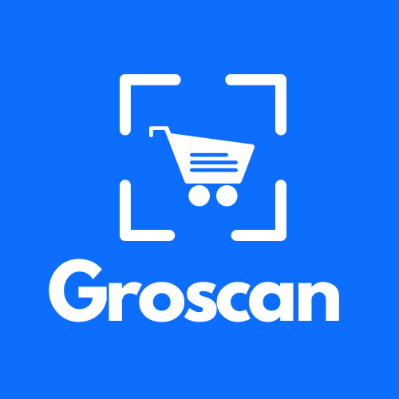

<h1 align="center">Groscan</h1></br>

<p align="center">
:leafy_green:  A JAM stack PWA, grocery management hybrid app built with Capacitorjs, React, TypeScript, Next.js, Prisma and MongoDB. :shopping_cart:
</p>
<br>

<p align="center">
  <a href="#"></a>
  <a href="#"></a>
  <a href="https://github.com/k4u5h4L"></a>
  <a href="#"></a>
  <a href="#"></a>
  <a href="#"></a>
</p>

<br>
<p align="center">
</img>
</p><br>

## Technologies used:

-   React as the UI library.

-   Next.js as the React framework for extra features and API backend.

-   REST as the API language.

-   MongoDB as the DB.

-   Prisma as the ODM.

-   NextAuth as the authentication backend with OTP logins.

-   Capacitor.js as the hybrid app framework to run the platform on Android and iOS.

## Prerequisites:

-   Node.js and yarn installed.

-   MongoDB installed and the daemon running locally or hosted on the cloud.

## To run:

-   Clone and cd into the repo.

```
git clone https://github.com/k4u5h4L/Groscan.git && cd Groscan
```

-   Install the dependencies

```
yarn install
```

-   Create a new file called `.env.local` and fill in variables and keys from different providers from the `.env.example` file.

-   Now with all the API keys and the backend server running, run development server for the client.

```
yarn dev
```

-   Now visit the location [localhost:3000](http://localhost:3000) to check out the site!

## Note:

-   This project is for learning purposes only, and not for commercial use.

-   Any contribution is welcome. You may fork the repo and issue a PR.
